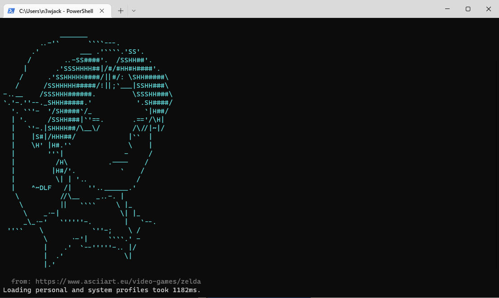

# ASCII Art Message of the Day

Sick and tired of seeing those Linux shells with fancy ASCII art and don't have someting like that for your Powershell console?
Well here's a solution for you!

Using the `Write-AsciiMotd.ps1` script you can now have a random piece of ASCII art appear from https://www.asciiart.eu when you open up a new shell window. Sweet ASCII bliss indeed.



## Installation

To run the script when you open a new Powershel console, you need to run it in your Powershell profile script.
Here's how to do that:

1. Open a Powershell console.
2. Clone the git repository somewhere, like your home folder:


    ````powershell
    git clone https://github.com/n3wjack/ascii-motd.git
    ````

3. Open your Powershell profile in your favorite text editor:

    ````powershell
    gvim $PROFILE
    ````
4. Call the script in your Powershell profile. If you used a different script location, you'll have to use that of course.

    ````powershell
    ~\ascii-motd\Write-AsciiMotd.ps1
    ````

That's it. Open a new Powershell console window to test if it works. You should now see some amazing ASCII art appear in the new window.

## Usage

Just run the script to get some random ASCII art:

````powershell
.\Write-AsciiMotd.ps1
````

You can also specify the color of the ASCII art to show using the `Color` command line parameter, like this:
 
````powershell
.\Write-AsciiMotd.ps1 -Color LightGreen
````

The colors are the ones you know from the `Write-Host` commandlet. You can use tab-completion to see all the options.

## License

This project is licensed under the [MIT license](https://github.com/n3wjack/ascii-motd/blob/main/LICENSE).

